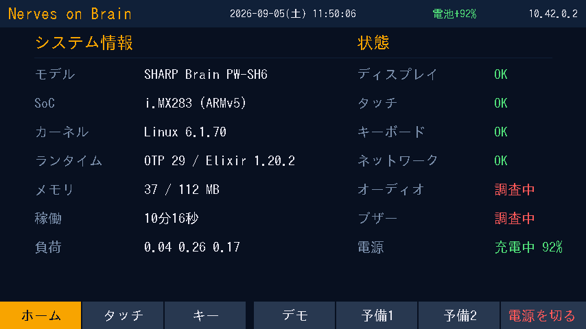
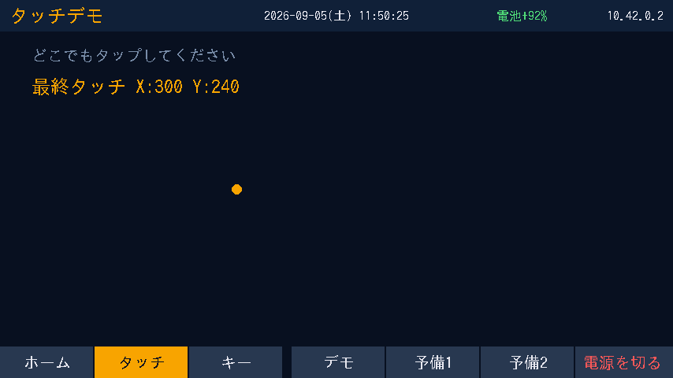
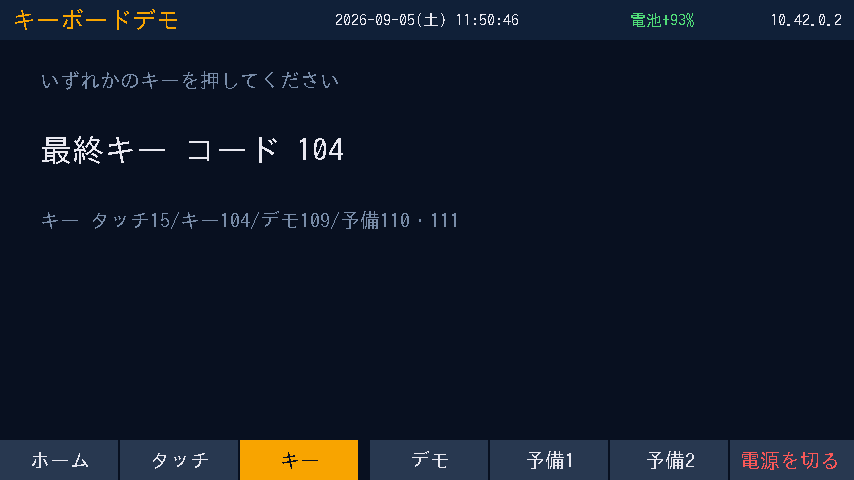
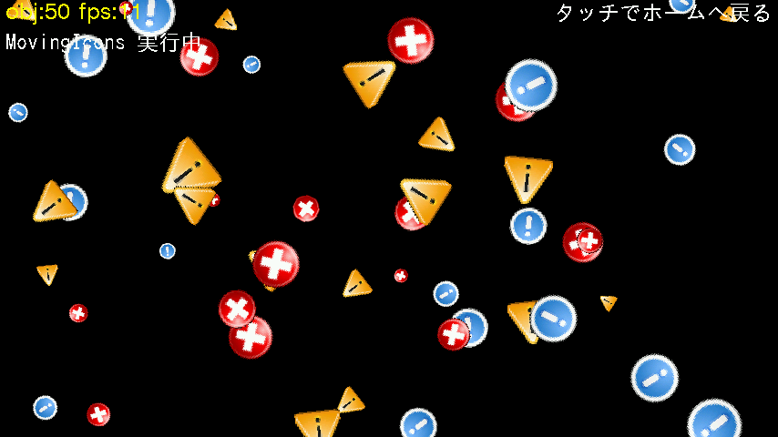
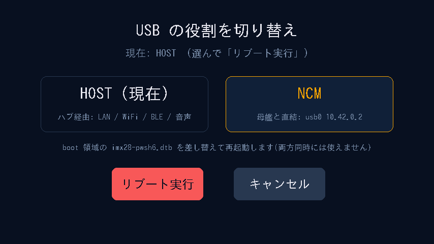
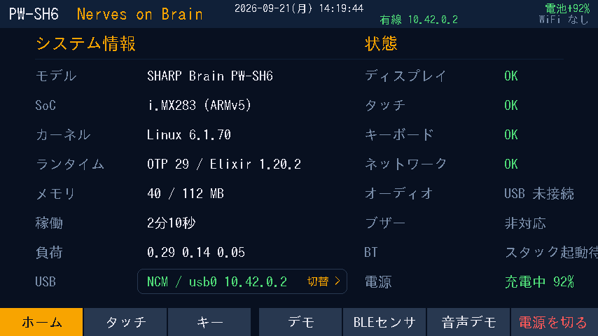

# hello_kiosk

`nerves_system_brain` 用の、SHARP **Brain PW-SH6** で動作確認済み Elixir KIOSK 例。
Mix アプリ名と release 名は既存環境との互換性のため `hello_kiosk_brain` のまま維持する。

- SoC: NXP i.MX283（ARM926EJ-S / ARMv5TEJ soft-float / RAM 128MiB）
- LCD: 5.5インチ 854×480（RGB565 LE, /dev/fb0 直描画）
- ネットワーク: NervesPack / VintageNet（USB-NCM direct、USB Ethernet、WiFi）
- ランタイム: OTP 29 + Elixir 1.20（Nerves 標準フローでは ERTS 同梱 release、旧配備フローでは ERTS 非同梱 release）
- システム: [nerves_system_brain](../..)（nerves_system_br ベース、
  カーネル/U-Boot は brain-hackers 資産を流用）

実機で KIOSK デモ（**LovyanGFX 日本語 UI**・タッチ・キーボード・電池表示・時計・下部バー7ボタン・電源ボタン/電源OFF確認）+ SSH（IEx / リモート評価 / SFTP）稼働中。
調査結果: 起動時タッチ遅延（SSH crypto 初期化が主因＝**解消済**）／バックライト（LCD 電源と一体で**独立制御不可**と実機確定）／音声（オンボード codec は回路情報の壁で凍結し **USB オーディオを本命**に）／電源OFF（5V 接続中は i.MX28 シリコン仕様で電源断維持不可＝再起動になる）。

## 画面（実機の /dev/fb0 をダンプした実スクリーンショット）

下部タブ（タッチ）またはキー 1/2/3/4 で 4 画面を切り替える。
描画は LovyanGFX NIF（`priv/kiosk_nif.so`、efont/IPA 日本語ゴシック）。
ヘッダ共通: 機種名（DTB の model から自動認識、例 `PW-SH6`）/ タイトル / 日時（JST、毎秒更新）/ 電池（LRADC 実測、充電中は+緑）/
取得 IP（有線 eth0 または NCM の usb0、WiFi wlan0 を 2 段で併記。取得済=緑）。

| ホーム | タッチ |
|---|---|
|  |  |

| キー | デモ |
|---|---|
|  |  |

- **ホーム**: 稼働秒数とサブシステム状態の一覧。「メモリ」は **`使用量 / 総量 MB`**（左＝使用量 `MemTotal-MemAvailable`、右＝総 RAM `MemTotal`。128MiB 機で約 112MB 総量。例 `38 / 112 MB` は使用 38MB・空き約 74MB）。
  「モデル」は `/proc/device-tree/model`。状態欄のオーディオ / BLE は、本体アプリの `Audio` / `BtSpeaker` / `SwitchBotScanner`
  モジュールがある場合だけ実状態を出し、本例（未同梱）では「未実装(本例)」と表示する
- **ホーム「USB」行**: USB0 のモード（`HOST / 機器 N台` または `NCM / usb0 IP`）を表示するボタン。タップで切替ダイアログ
  （HOST / NCM を選んで「リブート実行」）。`HelloKioskBrain.UsbMode` は System の `/usr/bin/brain-usb-mode` を呼ぶだけで、
  application 自身は DTB を保持・mount・書き換えしない。NCM は母艦と USB 直結（usb0 / VintageNetDirect）、HOST は
  セルフパワーハブ経由の LAN / WiFi / BLE / 音声。System は NCM 起動時に `enable_ethernet_gadget` で usb0 を作るだけで、
  address / DHCP は VintageNet が管理する

  | 切替ダイアログ | NCM で起動したホーム |
  |---|---|
  |  |  |
- **タッチ**: タップ位置に点を描画、座標表示（タッチは実機校正 + Y 反転）
- **キー**: 押されたキーのコード表示
- **デモ**: LovyanGFX MovingIcons（スプライト 50 個 11fps）。タッチ/キーでホームへ

## セットアップ（クローン後）

初回の System build、microSD 作成、USB-NCM 接続は
[初回セットアップガイド](../../docs/getting-started.md) を参照。

先にリポジトリルートで `mix brain.system.build` を実行し、`nerves_system_brain` の `o/` を作成する。
手動で `nerves_system_br/create-build.sh` や `make -C o` を実行する必要はない。
その後、このディレクトリで Nerves 標準寄りの firmware を構築する。

Erlang / Elixir のバージョンは `.tool-versions` で固定している。mise / asdf など任意の
バージョンマネージャーで事前にインストールし、以降は通常の Mix task として実行する。

```sh
export MIX_TARGET=brain

mix deps.get
mix firmware
```

LovyanGFX は、この NIF の source layout と実機検証済み構成に合わせて `1.2.29` に固定している。
`1.2.30` では v1 実装の source layout が変更され、従来の `Panel_Device.cpp` を直接ビルドする構成とは
互換性がないため、firmware build 時に upstream の最新 `master` は追従しない。

`NervesSSH` は shoehorn から KIOSK application より先に起動する。firmware build 時に
`~/.ssh/id_{rsa,ecdsa,ed25519}.pub` が見つかれば authorized key として取り込む。
application の rootfs overlay は `/etc/iex.exs` を配置し、`NervesMOTD.print/0` と `use Toolshed` により
通常の Nerves に近い IEx 環境を提供する。

PW-SH6 では OTP `:ssh` の `user_passwords` が PBKDF2 で非常に重かった実測があるため、
移行中は `NervesSSH` の `daemon_option_overrides` で軽量な `pwdfun` を残している。
公開鍵が無い場合も `user` / `brain` でログインできる。

networking は `NervesPack` / `VintageNet` に任せる。USB peripheral では `VintageNetDirect` が `usb0` と
peer DHCP を管理し、USB host では `VintageNetEthernet` が `eth0` を DHCP で設定する。WiFi は
`VintageNetWiFi` を使用し、credential は rootfs の `wpa_supplicant.conf` ではなく VintageNet configuration として設定する。
接続確認時は IEx から `VintageNet.info()`、WiFi の簡易設定は
`VintageNetWiFi.quick_configure("SSID", "passphrase")` を利用できる。

生成される `.fw` は、現在の FAT p1 + ext4 p2 レイアウトに合わせた firmware である。
`complete` task は pinned buildbrain release の boot assets と、ERTS 同梱の Nerves release を
blank SD にまとめて配置できる。

この example app は同じ repository の `nerves_system_brain` を local path dependency として参照する。
System / toolchain package の公開後は version dependency へ置き換え、通常の Nerves application と同じ
`MIX_TARGET=brain` / `mix firmware` の使い方を維持する。

旧来の ERTS 非同梱 release 配備パスも当面維持する。標準 Nerves flow の切り分けや rootfs の
recovery に使えるが、今回削除した独自 `SshDaemon` と同等の SSH 機能までは保証しない。
必要な場合は、次の script で従来形式の release を構築できる。

```sh
./scripts/build_release.sh
```

既定では [`nerves_system_brain`](../..) の `o/` を参照する。別のシステムリポジトリや
Buildroot 出力を使う場合は次のように指定できる。

```sh
NERVES_SYSTEM_BRAIN_DIR=/path/to/nerves_system_brain ./scripts/build_release.sh
NERVES_BUILD_DIR=/path/to/build-output ./scripts/build_release.sh
```

SD の作成・初回配備はリポジトリルートの `sd/` 以下を使用する。

> **SSH / crng**: 初期実装では独自 `SshDaemon` の crypto 初期化が UI を長時間
> ブロックした。標準化 branch では `NervesSSH` へ移行し、既知の PBKDF2 問題だけを
> `HelloKioskBrain.SshAuth` の軽量 `pwdfun` として残している。NervesSSH の host-key 生成を含む
> 起動負荷は次回実機確認する。過去の調査経緯は
> [SSH 起動不能の調査記録](docs/worklog/20260903_SSH起動不能_セカンドオピニオン質問書.md) を参照。

## 開発サイクル（SD 往復不要）

```sh
./scripts/build_release.sh     # リリース構築（staging から armv5 OTP アプリを合流）
# 変更 beam を sftp で /srv/erlang/lib/hello_kiosk_brain-*/ebin へ put
ssh user@nerves.local ':code.purge(Mod); :code.load_file(Mod); GenServer.stop(HelloKioskBrain.Display)'
./scripts/screenshot.sh        # 実機 LCD をリモートで PNG 取得
./scripts/settime.sh           # 母艦の時刻を Brain に設定(RTC 非搭載のため毎ブート後に)
```

> 実機に電池バックアップ付き RTC は無く(/dev/rtc0 も無し)、時計は毎ブート
> 1970 年起点に戻る。KIOSK ヘッダの時計は未設定時「時刻未設定」表示になるので、
> ブート後に `settime.sh` で合わせる。

初回の SD 作成・配置はリポジトリルートの `sd/`（populate_sd.sh → deploy_release.sh）。

## モジュール構成

| モジュール | 役割 |
|---|---|
| `HelloKioskBrain.Native` | LovyanGFX 描画 NIF ローダ（init_display / render / MovingIcons）。hello_kiosk_papapa と同一構成 |
| `HelloKioskBrain.Draw` | 描画コマンド DSL（clear/rect/line/circle/text…、日本語 jp8〜jp40）。NIF 非依存の純粋関数 |
| `HelloKioskBrain.Kiosk` | KIOSK デモ GUI（下部バー7ボタン=ホーム/タッチ/キー/デモ/予備1/予備2/電源を切る、物理キー15/104/109/110/111 と対応、電池/IP/時計、電源OFF確認）。LovyanGFX NIF 描画 |
| `HelloKioskBrain.Backlight` | LCD バックライト sysfs ラッパ（現状**未使用**。PW-SH6 はバックライトを独立制御できないと実機で判明。[調査結論](docs/adr/0003-バックライト制御線_調査結論.md)参照） |
| `HelloKioskBrain.Fb` | 旧・シャドウフレーム描画（フォールバックとして残置） |
| `HelloKioskBrain.Font` | 旧・5×7 ビットマップフォント（Fb 用、残置） |
| `HelloKioskBrain.Input` | evdev 読取り（タッチ event1 / キー event0）。タッチは実機校正 + Y 反転済み |
| `HelloKioskBrain.Battery` | i.MX28 HW_POWER から電池電圧/充電状態（devmem 経由） |
| `HelloKioskBrain.Display` | 旧・最小 KIOSK 画面（Kiosk に置換、参考として残置） |
| `HelloKioskBrain.SshAuth` | NervesSSH 用の PW-SH6 固有 lightweight password callback（公開鍵認証 / IEx / exec / SFTP 自体は NervesSSH が担当） |

補助バイナリ `devmem`（/dev/mem mmap R/W）は `src/devmem.c` から `build_release.sh` で ARMv5 向けに生成する。

## ドキュメント

設計判断・調査記録の一覧は [`docs/README.md`](docs/README.md) を参照。

- `docs/adr/`: 実装や今後の方針に影響する決定・確定した技術的結論
- `docs/worklog/`: 提案、調査過程、実装報告、手順、質問書、引き継ぎなどの時系列記録
