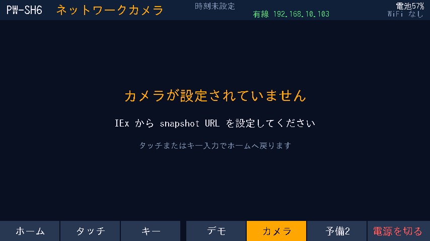
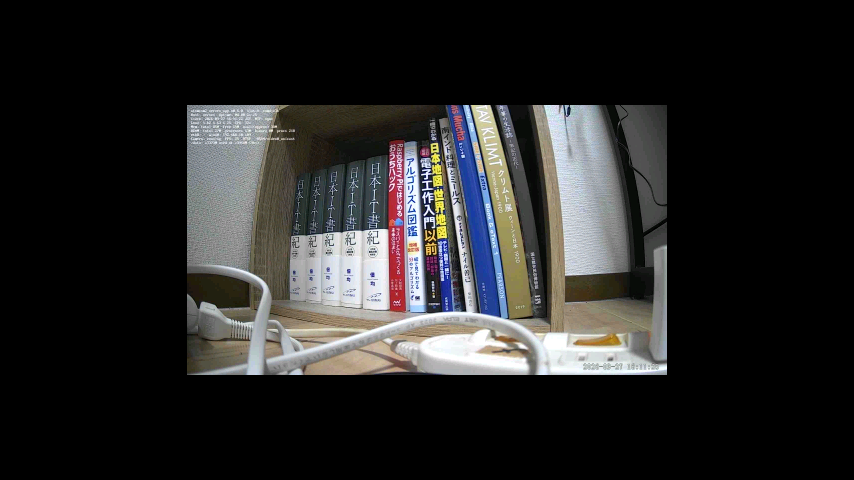
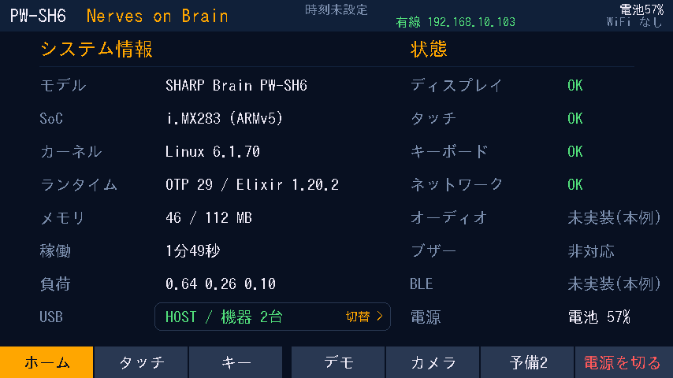

# ネットワークカメラモニタ基本設計

## 目的

SHARP Brain PW-SH6 を Atom Cam 2 のネットワークカメラモニタとして利用できるか確認する。

Brain 側だけを変更し、Atom Cam 2 側は既存の HTTP JPEG snapshot (`GET /snapshot.jpg`) をそのまま利用する。
実機が手元にない段階では host で native decode / Port protocol まで実装・検証し、PW-SH6 では性能値と framebuffer 表示だけを後から確認できる形にする。

```text
Atom Cam 2
  /snapshot.jpg
       |
       | HTTP / LAN
       v
SHARP Brain
  CameraMonitor
       |
       | one JPEG at a time
       v
  camera_viewer (Erlang Port)
       |
       | libjpeg-turbo / RGB565LE
       v
  854x480 shadow frame
       |
       | one full-frame write
       v
    /dev/fb0
```

## 責務分離

`nerves_system_brain` は OS / hardware capability を提供し、camera 固有の動作は `hello_kiosk` が所有する。

- `nerves_system_brain`
  - libjpeg-turbo を rootfs / staging sysroot に追加する。
- `examples/hello_kiosk`
  - `CameraMonitor` が HTTP / retry / backpressure / metrics を管理する。
  - `camera_viewer` が JPEG decode / RGB565 変換 / framebuffer write を担当する。
  - KIOSK が camera mode の enter / exit と framebuffer ownership を管理する。
- `nerves_system_atomcam2`
  - 初期 PoC / MVP では変更しない。

## 実装済み構成

### Buildroot

`nerves_defconfig`:

```text
BR2_PACKAGE_JPEG=y
BR2_PACKAGE_JPEG_TURBO=y
```

ARMv5 では NEON SIMD は利用できないため、最終的な frame rate は実機測定で決める。

### camera_viewer

source:

```text
examples/hello_kiosk/src/camera_viewer.c
```

target build artifact:

```text
priv/bin/camera_viewer
```

`Makefile` は Nerves target build で `NERVES_SDK_SYSROOT` が存在するときだけ `camera_viewer` を build する。
通常の host `mix test` は libjpeg development package を要求しない。

#### CLI mode

local JPEG benchmark / offline validation 用。

```text
camera_viewer [--scale 1|2|4|8] [--output PATH | --dry-run] JPEG
```

例:

```sh
camera_viewer --dry-run /data/snapshot.jpg
camera_viewer /data/snapshot.jpg
camera_viewer --output /tmp/frame.rgb565 /data/snapshot.jpg
```

1920x1080 JPEG を default `1/4` decode すると 480x270 となり、854x480 frame の中央に配置する。
full RGB888 image は保持せず、decode scanline を RGB565LE shadow frame に直接書く。

#### Erlang Port mode

live monitor 用。

```text
camera_viewer --port --scale 4 --max-jpeg-bytes 2097152
```

Erlang `Port.open/2` の `{:packet, 4}` framing を利用する。
stdin では 1 packet = 1 JPEG、stdout では 1 packet = 1 ACK とする。stdin の 0-byte packet は graceful stop とし、先行する framebuffer write の完了後に helper を終了する。stderr は diagnostics 専用で protocol に混ぜない。

成功 ACK:

```text
byte 0      0
byte 1..2   input width   (big endian u16)
byte 3..4   input height  (big endian u16)
byte 5..6   output width  (big endian u16)
byte 7..8   output height (big endian u16)
byte 9..12  decode_us     (big endian u32)
byte 13..16 write_us      (big endian u32)
```

失敗 ACK:

```text
byte 0      1
byte 1..2   error code (big endian u16)
byte 3..N   error message
```

native helper を NIF ではなく standalone process にすることで、decoder crash を BEAM から分離する。

### CameraMonitor

`HelloKioskBrain.CameraMonitor` は application supervisor 配下で常駐し、通常は `:idle` のまま待機する。

public API:

```elixir
HelloKioskBrain.CameraMonitor.enable()
HelloKioskBrain.CameraMonitor.disable()
HelloKioskBrain.CameraMonitor.status()
HelloKioskBrain.CameraMonitor.set_snapshot_url("http://192.0.2.10/snapshot.jpg")
```

主な state:

```text
:idle
:starting
:connecting
:rendering
:streaming
:retrying
```

live loop:

```text
GET /snapshot.jpg
      |
      v
Port.command(jpeg)
      |
      v
camera_viewer decode + framebuffer write
      |
      v
ACK
      |
      +----> next GET
```

ACK を受けるまで次 frame を取得しない。Brain 側が遅くても frame queue を作らず、throughput より「新しい画像に近いこと」を優先する。

HTTP GET 自体は `Task` で行うため、`CameraMonitor` GenServer を request timeout の間 block しない。

### HTTP 設定

`examples/hello_kiosk/config/target.exs`:

```elixir
camera_monitor: [
  snapshot_url: nil,
  interval_ms: 500,
  retry_ms: 1_000,
  request_timeout_ms: 4_000,
  stop_timeout_ms: 1_000,
  max_jpeg_bytes: 2 * 1024 * 1024,
  scale: 4
]
```

Atom Cam 2 の `CameraNative.snapshot/1` は fresh snapshot 作成時に最大 3 秒待つ実装なので、Brain 側 timeout は 4 秒にする。

firmware に特定 LAN の IP address を埋め込まないよう、default は未設定とする。
IEx から `CameraMonitor.set_snapshot_url/1` で HTTP URL を設定できる。未設定の `enable/0` は `{:error, :camera_not_configured}` を返す。HTTPS は CA verification 方針を定めるまで受け付けない。

OTP 29 の `:httpc` は `http://` request でも default SSL verify option を作る際に OS CA certs を読む。PW-SH6 rootfs には CA certs がないため、`ssl: [verify: :verify_none]` を明示してこの lookup を避ける。

`atomcam2.local` のような hostname を使う場合は、Atom Cam 2 に一意な hostname を設定する。現在の Atom Cam 2 snapshot では既定 hostname / mDNS alias に `nerves` が含まれ、Brain 側も `nerves.local` を advertise できるため、同一 LAN で名前が衝突し得る。

### KIOSK integration

下部バーの `予備1` (physical key 110) を `カメラ` に変更する。

```text
ホーム / タッチ / キー / デモ / カメラ / 予備2 / 電源を切る
```

camera mode enter:

```text
Kiosk
  |
  | paint "connecting" placeholder
  v
CameraMonitor.enable()
  |
  v
camera_viewer owns framebuffer writes
```

camera mode 中は KIOSK の 1 秒 tick で `Native.render/1` を呼ばない。
LovyanGFX と `camera_viewer` が同時に `/dev/fb0` を更新しないよう、screen state で ownership を分ける。

任意の touch / key、または power confirmation へ遷移するとき:

```text
CameraMonitor.disable()
  |
  | 0-byte stop packet / wait for Port exit (bounded timeout)
  v
Kiosk renders next screen
```

## Host で確認済みの項目

host 環境で次まで確認済み。

- `camera_viewer.c` が host libjpeg で warning なし compile できる。
- 1920x1080 JPEG を 1/4 decode し、480x270 を 854x480 RGB565LE frame 中央へ配置できる。
- output frame size が `854 * 480 * 2 = 819840` bytes になる。
- CLI `--dry-run` / file output が動作する。
- `--port --dry-run` に JPEG packet を送ると 17-byte success ACK が返る。
- invalid JPEG では renderer error ACK が返り、Port process 自体は次 frame を受けられる状態を維持する。

host の decode time は PW-SH6 の性能値としては扱わない。

## 実機確認手順と評価項目

### Phase 0: local JPEG benchmark

1. Atom Cam 2 の実際の `/snapshot.jpg` を 1 枚取得する。
2. `mix firmware` / `mix upload` で Brain firmware を更新する。
3. JPEG を `/data/snapshot.jpg` に配置する。
4. helper path を取得する。

```elixir
viewer =
  :hello_kiosk_brain
  |> :code.priv_dir()
  |> to_string()
  |> Path.join("bin/camera_viewer")
```

5. framebuffer を変更しない benchmark:

```elixir
System.cmd(viewer, ["--dry-run", "/data/snapshot.jpg"], stderr_to_stdout: true)
```

6. 実画面表示:

```elixir
System.cmd(viewer, ["/data/snapshot.jpg"], stderr_to_stdout: true)
```

確認項目:

- `decode_ms`
- `write_ms`
- RGB565 色順 / endian
- 480x270 中央配置
- framebuffer corruption
- SSH / IEx responsiveness
- `MemAvailable`

### Phase 1: live camera monitor

KIOSK の `カメラ` を開き、以下を確認する。

```elixir
HelloKioskBrain.CameraMonitor.status()
```

見る値:

```text
state
frames_received
frames_rendered
failures
download_ms
decode_ms
framebuffer_ms
last_error
```

初期目標:

- 2 fps 前後
- camera -> LCD latency 1 秒未満を目標
- frame queue が増えない
- disconnect / HTTP 503 / invalid JPEG で BEAM が落ちない
- reconnect 後に frame 更新が再開する
- camera mode 終了後に KIOSK home が正常再描画される
- 1 時間連続動作で leak / corruption がない

## 2026-09-27 実機確認

Brain `192.168.10.103`、Atom Cam 2 `192.168.10.109` / `192.168.10.110` で確認した。

母艦からは両方の Atom Cam が `/snapshot.jpg` を返した。snapshot は 1920x1080 JPEG、約 44 KiB。
Brain からは `192.168.10.110` が安定して snapshot を返したため、target config の default は `.110` にした。
`.109` は Brain からの `:httpc` request で timeout した。

`mix upload` で実機へ投入した。最初の upload 後、OTP 29 の `:httpc` が `http://` request でも SSL verify option 初期化時に OS CA certs を読みに行き、CA certs がない PW-SH6 rootfs で `:pubkey_os_cacerts.conv_error_reason/1` の例外になった。
`ssl: [verify: :verify_none]` を `:httpc.request/4` の HTTP options に明示して修正した。

修正後の実測:

```text
KIOSK camera mode 15 秒
  frames_received: 19
  frames_rendered: 19
  failures: 0
  download_ms: 33.003
  decode_ms: 129.149
  framebuffer_ms: 13.555
```

camera mode は key 110 で enter、任意 key で home に戻ることを確認した。exit 後は:

```text
screen: :home
CameraMonitor.enabled: false
CameraMonitor.state: :idle
```

HTTP failure path は、存在しない `192.168.10.254` を指定して確認した。`failures` が増え、`last_error` に `:ehostunreach` が入り、BEAM / KIOSK / SSH は継続した。

1 時間の連続動作試験はこの PR では実施せず、後続の soak test とする。

## 2026-09-27 PR review 対応

- libjpeg の `setjmp` / `longjmp` 後も cleanup 判定が保たれるよう、decompressor 生成フラグを `volatile` にした。malformed JPEG を 10,000 回連続投入し、host の helper RSS が 2,052 KiB のまま増加しないことを確認した。
- camera mode 終了時は 0-byte stop packet を送り、先行 frame の decode / write と helper の終了を待ってから `disable/0` を応答する。1 秒の timeout 時は Port を強制終了する。
- camera URL の firmware default を `nil` にし、未設定の `enable/0` は `{:error, :camera_not_configured}` を返す。現時点では HTTP URL のみ受け付ける。
- packet 長の取得後に JPEG buffer の確保に失敗した場合は、未読 payload を次の header と誤認しないよう helper を終了する。

修正後の Brain 実機では、camera mode 終了に 195.583 ms かかり、処理中の frame 完了を待つことを確認した。home 描画直後と500 ms後の framebuffer SHA-256 は同一で、camera image による遅延上書きは発生しなかった。

### 実機スクリーンショット

camera URL 未設定:



Atom Cam 2 live snapshot:



camera mode 終了直後の home:



## 次の設計判断

実機 `decode_ms` が十分小さければ、Atom Cam 2 は変更せず `/snapshot.jpg` 方式を MVP として継続する。

1080p JPEG の転送や decode が無駄と分かった場合だけ、Atom Cam 2 側に 640x360 JPEG endpoint を追加する。
さらに滑らかさが必要なら 640x360 MJPEG を次候補とする。

RTSP / H.264 software decode は最初の fallback にはしない。
